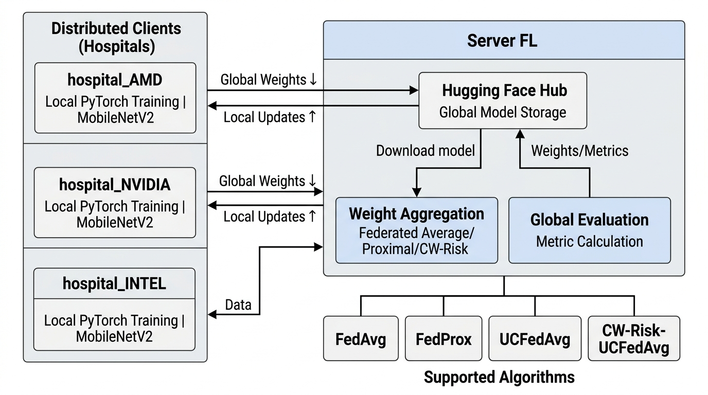

# 🩺 Federated Learning for Skin Lesion Classification



This project implements and evaluates **Federated Learning (FL)** algorithms in the medical domain, specifically for classifying 7 skin lesion types on the **HAM10000** dataset and performing external validation on the **ISIC 2019** dataset.

The project addresses key challenges of Federated Learning in clinical settings:
1. **Data Heterogeneity (Non-IID)**: Major discrepancies in data volume (Quantity Skew) and label distribution (Label Skew) across hospital sites (clients).
2. **Clinical Class Imbalance & Medical Severity**: Prioritizing diagnostic accuracy for high-risk diseases (such as Melanoma) over common benign conditions.
3. **Local Model Reliability**: Measuring the uncertainty of local client models using **Conformal Prediction**.

---

## 🚀 Key Features

- **Decentralized Synchronization**: Utilizes the **Hugging Face Hub** as a central communication channel (Communication Hub) between the Server and clients (`hospital_AMD`, `hospital_NVIDIA`, `hospital_INTEL`). Clients and the server exchange model weight files (`.safetensors`) and metadata (`.json`) asynchronously or synchronously without requiring direct peer-to-peer connections.
- **Multiple FL Methods Supported**:
  - **FedAvg (Federated Averaging)**: The baseline FL algorithm, performing weighted averaging of model weights based on client sample sizes.
  - **FedProx (Federated Proximal)**: Introduces a proximal regularization term to the local loss function to restrict local models from drifting too far from the global model under Non-IID data distributions.
  - **UCFedAvg (Uncertainty-Conformal Federated Averaging)**: Evaluates client reliability dynamically by measuring coverage quality, average prediction set size, and mean nonconformity using Conformal Prediction on local validation sets.
  - **CW-Risk-UCFedAvg (Class-Wise Risk-adjusted Uncertainty-Conformal Federated Averaging)**: An advanced custom method. It performs standard UCFedAvg aggregation on the feature extractor (backbone) layers, but aggregates the classifier head layers **class-wise** based on class-specific client performance and clinical risk weights (e.g., placing higher weights on high-risk categories like Melanoma).
- **Rigorous Evaluation Workflow**: An automated batch evaluation process downloads the best global models across different scenarios (IID, Non-IID, Quantity Skew) from Hugging Face, evaluates them on the independent ISIC 2019 test set, and generates comparative metrics (ROC-AUC curves, normalized confusion matrices, Excel/CSV reports).
- **Leakage-Free Validation**: Enforces strict verification to ensure no image or patient case (lesion ID) overlap between client train/validation sets and the global test set, guaranteeing unbiased clinical evaluation.

---

## 📂 Codebase Structure

The codebase is organized into Jupyter Notebooks representing different experiment phases and methods:

1. 💻 **[server-client-fedavg.ipynb](server-client-fedavg.ipynb)**: Implements the baseline FL experiment using **FedAvg**. Automates global model initialization on HF, coordinate training rounds, and client aggregation.
2. 💻 **[server-client-fedfrox.ipynb](server-client-fedfrox.ipynb)**: Implements the **FedProx** method. Clients optimize a regularized loss function with a proximal parameter $\mu = 0.01$ to stabilize convergence.
3. 💻 **[server-client-wc-risk-ucfedavg.ipynb](server-client-wc-risk-ucfedavg.ipynb)**: Core implementation of the **UCFedAvg** and **CW-Risk-UCFedAvg** algorithms. Integrates the conformal prediction modules, client metric computation, and class-wise parameter aggregation.
4. 💻 **[evaluation.ipynb](evaluation.ipynb)**: Batch evaluation script. Downloads global models from Hugging Face repositories, evaluates them on the independent test set, and produces final reports.
5. 📊 **[Data](Data)**: Contains the data partition files for training and validation splits:
   - [Data_Source.md](Data/Data_Source.md): Download links for raw HAM10000 and ISIC 2019 datasets on Kaggle.
   - [split_validation_report.json](Data/split_validation_report.json): Validation report confirming zero image/lesion overlap between splits and test sets.
   - [global_test_distribution.json](Data/global_test_distribution.json): Label distribution of the independent test set.
   - `iid/`, `noniid_label_skew/`, `quantity_skew/`: CSV metadata files splitting training/validation samples to individual clients for each experimental scenario.

---

## 🛠️ Setup & Experiment Configurations

### 1. Data Partitioning Scenarios
Simulates 3 Hospital Clients with varying data characteristics: `hospital_AMD`, `hospital_NVIDIA`, and `hospital_INTEL`.
- **IID**: Data is shuffled and divided equally. Label distribution remains identical across clients.
- **Quantity Skew**: Data volumes are heavily imbalanced (NVIDIA has the largest share, AMD moderate, and INTEL the smallest).
- **Non-IID Label Skew**: Severe class distribution skew. Some clients lack or have very few samples for specific classes.

### 2. Skin Lesion Categories (7 Classes)
The MobileNetV2 architecture is fine-tuned to classify 7 lesion types:
- `nv`: Melanocytic nevi (Melanocytic Nevi - Risk Weight: 1.00)
- `bkl`: Benign keratosis-like lesions (Benign Keratosis - Risk Weight: 1.10)
- `vasc`: Vascular lesions (Vascular Lesions - Risk Weight: 1.20)
- `df`: Dermatofibroma (Dermatofibroma - Risk Weight: 1.20)
- `bcc`: Basal cell carcinoma (Basal Cell Carcinoma - Risk Weight: 1.40)
- `akiec`: Actinic keratoses (Actinic Keratosis - Risk Weight: 1.50)
- `mel`: Melanoma (Melanoma - Most critical skin cancer - Risk Weight: 1.60)

---

## 📈 CW-Risk-UCFedAvg Algorithm Mechanics

The algorithm updates network parameters by separating the model architecture:
1. **Backbone (Feature Extractor)**:
   Aggregated using a client-level weight $w_k$:
   

   Where $\text{Reliability}_k$ is computed from Conformal Prediction metrics on the client's local validation set (penalizing clients with excessively large prediction sets or actual coverages that drift far from the target coverage $1-\alpha$).

2. **Classifier Head (Final Linear Layer)**:
   Aggregated using class-specific weights $\alpha_{k,c}$ for each class $c$:
   

   Where $\text{Reliability}_{k,c}$ measures the client's class-wise diagnostic capabilities (integrating Class-wise Recall, F1-score, and conformal coverage quality). This safeguards model accuracy on rare or high-risk diseases, even when clients exhibit severe label skew.

---

## 🏁 How to Run the Experiments

These experiments are designed to run in a **Kaggle Notebook** environment to leverage free GPU resources and easily access the datasets.

### 1. Kaggle Environment Setup
1. **Upload Notebook**: Create a new Notebook on Kaggle and upload the desired experiment notebook (e.g., [server-client-wc-risk-ucfedavg.ipynb](server-client-wc-risk-ucfedavg.ipynb)).
2. **Enable GPU**: In the right-hand settings panel under **Accelerator**, select a GPU accelerator (e.g., **GPU T4 x2** or **GPU P100**).
3. **Attach Datasets**: Attach the following Kaggle datasets to your notebook:
   - [Skin Cancer MNIST: HAM10000](https://www.kaggle.com/datasets/kmader/skin-cancer-mnist-ham10000) (For raw skin lesion images)
   - [ISIC 2019](https://www.kaggle.com/datasets/andrewmvd/isic-2019) (For batch evaluation input)
   - [chisdong's custom dataset](https://www.kaggle.com/datasets/chisdong) (Contains IID, Non-IID, Quantity split CSVs and global test metadata)
4. **Add Secrets (HF Token)**:
   - Go to **Add-ons** -> **Secrets** in the top menu.
   - Add a new secret with the Name `HF_TOKEN` and paste your Hugging Face write-access API token.
   - Enable the toggle next to your notebook to expose the secret to the environment.

### 2. Environment Preparation
Install the required packages from [requirements.txt](requirements.txt):
```bash
pip install -r requirements.txt
```

### 3. Training Process
1. Open the notebook of the algorithm you wish to run (e.g., `server-client-wc-risk-ucfedavg.ipynb`).
2. Adjust configuration parameters at the top of the file:
   - `SERVER_REPO`: The Hugging Face global server repository.
   - `CLIENT_CONFIGS`: Client IDs and their corresponding HF repositories.
   - `TRAINING_SCENARIO`: The data split scenario (`iid`, `noniid_label_skew`, or `quantityskew`).
3. Run the **Server** cells to initialize the global model at round 0 using `init_global_model()`.
4. Run the automated orchestration training loop:
   - Calling `run_auto_fl_training()` executes the federated training loop:
     - Client downloads the latest global model weights, trains locally for 1 epoch.
     - Client computes parameter deltas and conformal validation metadata, then uploads them to HF.
     - Server waits for all clients to finish, downloads the deltas, executes the aggregation (FedAvg / UCFedAvg / CW-Risk-UCFedAvg), evaluates the new global model, and updates server metadata for the next round.
     - Early stopping stops training if the optimization score does not improve within a set number of rounds (`patience`).

### 4. Evaluation
Once training is complete for different methods and scenarios, open **[evaluation.ipynb](evaluation.ipynb)**:
1. Populate `MODEL_PATHS` with the repository paths containing the best `.safetensors` model weights.
2. Run all cells to perform batch evaluation on the independent ISIC 2019 test set.
3. The results will be stored under `/kaggle/working/batch_eval_results` (including performance plots, CSV/Excel summaries, and a compressed zip archive).
